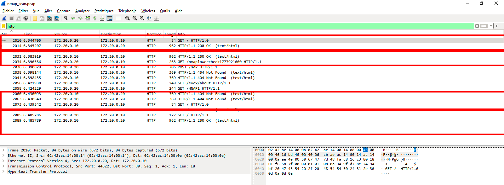
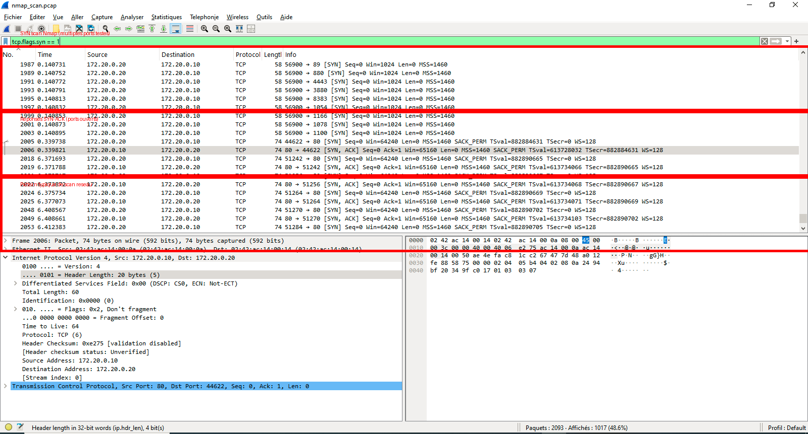

# Mini SOC – Analyse de trafic réseau & détection d’anomalies

## Objectif

Ce projet consiste à mettre en place un laboratoire réseau simulé avec Docker afin de capturer, analyser et interpréter du trafic réseau.

L’objectif est de comprendre les comportements réseau, identifier des activités suspectes et démontrer les différences entre communications sécurisées et non sécurisées.

---

## Architecture

Le laboratoire repose sur deux conteneurs Docker :

- **nginx-server** : serveur web (HTTP)
- **client-analyzer** : machine d’analyse (tcpdump, nmap, curl)

**Réseau interne Docker** :

client-analyzer (172.20.0.20) → nginx-server (172.20.0.10)

---

## Technologies utilisées

- Docker & Docker Compose  
- Linux (Ubuntu / Kali)  
- Nginx  
- Tcpdump  
- Wireshark  
- Nmap  
- HTTP / TCP/IP  

---

## Scénarios analysés

### Capture de trafic HTTP

Une requête HTTP est générée vers le serveur web afin d’analyser le trafic réseau.

## Résultat :

### Observations

- Les requêtes HTTP (`GET /`) sont visibles en clair  
- Les headers (Host, User-Agent) sont interceptables  
- Le serveur répond avec `HTTP/1.1 200 OK`

### Conclusion

> Le protocole HTTP ne chiffre pas les données → vulnérable à l’interception.

---

### Détection d’un scan réseau (Nmap)

Un scan Nmap est lancé contre le serveur cible.

📸 Résultat :

### Observations

- Envoi de paquets `[SYN]` vers plusieurs ports  
- Réponses `[SYN, ACK]` indiquant les ports ouverts  
- Comportement répétitif typique d’un scan automatisé  

### Conclusion

> Le scan Nmap génère des signatures réseau détectables, exploitables pour la détection d’intrusion.

---

## Analyse réseau

### TCP

- Port 80 utilisé (HTTP)  
- Connexion établie via handshake TCP  
- Trafic non chiffré observable  

---

### Sécurité

| Protocole | Sécurité |
|----------|--------|
| HTTP     | ❌ Non chiffré |
| SSH      | ✔ Chiffré |
| HTTPS    | ✔ Sécurisé |

---

## Compétences mises en œuvre

- Analyse de trafic réseau (Wireshark, Tcpdump)  
- Compréhension des protocoles TCP/IP  
- Détection de scans réseau  
- Interprétation de paquets réseau  
- Sécurisation des communications  
- Utilisation de Docker pour simuler un réseau  

---

## Résultats

Ce projet démontre :

- la capacité à analyser du trafic réseau réel  
- la détection de comportements suspects (scan Nmap)  
- la compréhension des risques liés aux communications non sécurisées  

---

## Améliorations possibles

- Ajouter HTTPS (TLS) pour comparer avec HTTP  
- Intégrer un IDS (Suricata / Zeek)  
- Ajouter un firewall (UFW)  
- Créer un dashboard ELK  
- Simuler une attaque (brute force, scan avancé)

---

## Intérêt professionnel

Ce projet reproduit un cas réel d’analyse SOC :

- surveillance réseau  
- détection d’activités suspectes  
- analyse de trafic  
- investigation sécurité  

---

## 🌐 Project Page

A visual presentation page is available in `index.html`.

## Auteur

**Idrissa SALL**  
Ingénieur IT • Réseaux • Cybersécurité • Data
